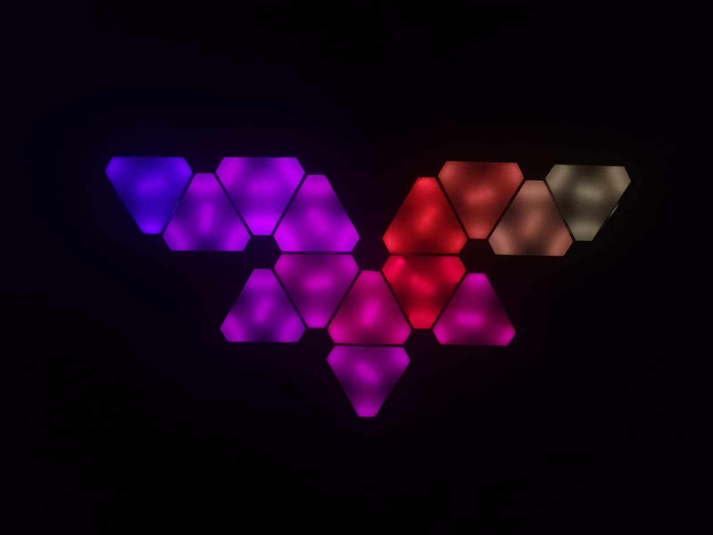
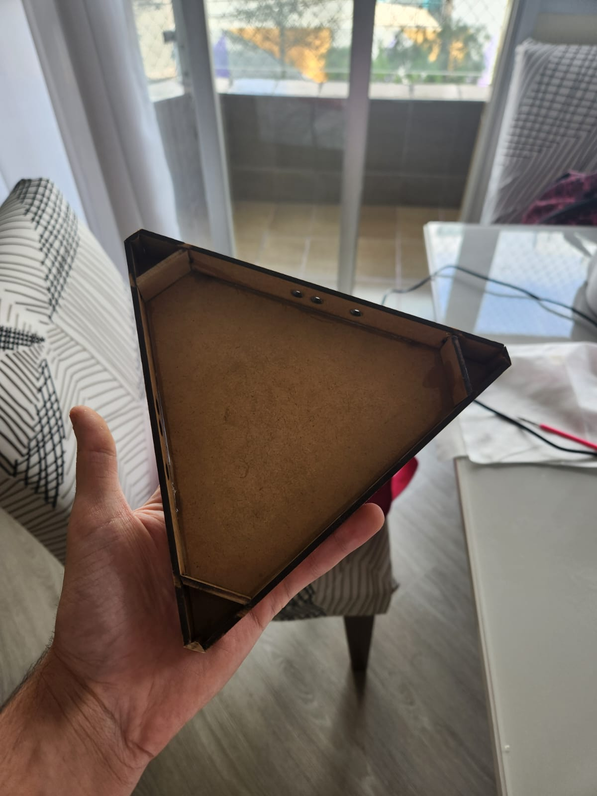
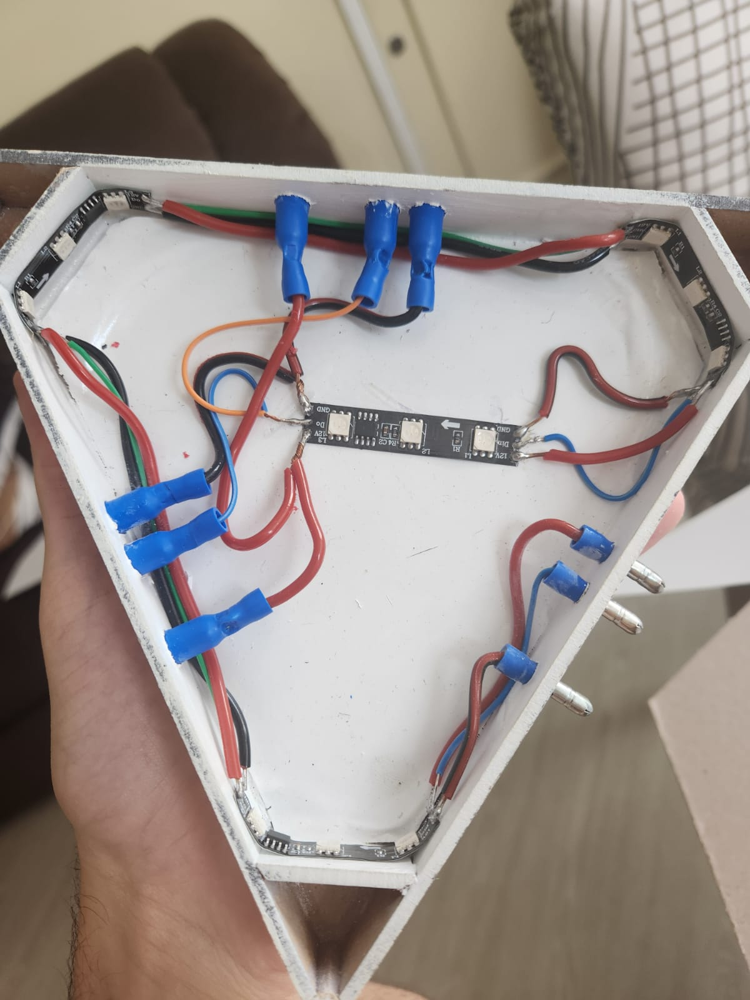
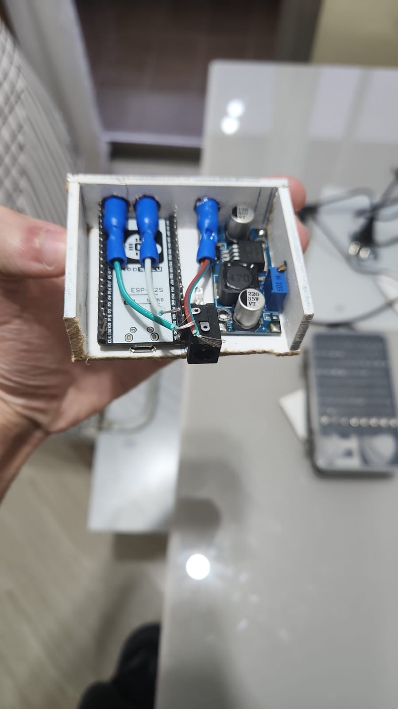

#  

### 💡 Detalhamento Técnico: Painéis Modulares de LED 🛠️

Este repositório documenta a construção de painéis de LED modulares inspirados na tecnologia Nanoleaf. O foco do projeto foi a criação de uma estrutura física robusta em MDF e um sistema de interconexão modular funcional.

  

---

## 🏗️ Estrutura Física e Fabricação

A construção utilizou materiais densos para garantir durabilidade e evitar vazamento de luz:

* 📐 **Carcaça:** Estrutura externa em **MDF de 15mm** cortado a laser.
* 📏 **Geometria:** Triângulos com 8cm de lado. As pontas possuem um achatamento de 1cm para permitir a passagem de cabos e conectores.
* 🎨 **Tratamento Interno:** Pintura em branco fosco para atuar como câmara de reflexão, garantindo maior eficiência luminosa.
* 🧲 **Acoplamento:** Ímãs de neodímio embutidos nas laterais para facilitar o alinhamento físico entre os módulos.
* ⚪ **Difusão:** Painel frontal em **poliestireno branco**, selecionado para homogeneizar a luz dos LEDs internos.

  
  

---

## ⚡ Eletrônica e Conectividade

O sistema elétrico foi desenhado para operar com alta tensão nos LEDs e lógica de controle dedicada:

* 🧠 **Controlador Central:** **ESP-32S** alojado em um módulo mestre externo.
* 💡 **Iluminação:** 4 segmentos de fita de LED **WS2811 (12V)** por triângulo. Como o chip controla grupos de 3 LEDs, a programação mapeia 4 pontos lógicos por módulo.
* 🔋 **Alimentação:** Entrada de **12V (Jack P4)**. Um conversor **Step-down** interno reduz a tensão para 5V exclusivamente para alimentar o ESP32.
* 🔌 **Interconexão:** Sistema de **Terminais Bala** para transmissão serial de Dados, VCC (12V) e GND.
    * **Entrada (Macho):** 1 terminal.
    * **Saída (Fêmea):** 2 terminais para ramificação do sinal.
* 📡 **Input:** Sensor **Infravermelho (IR)** para recepção de comandos via controle remoto.

  
  
  

---

## 🚀 Pontos de Melhoria e Evolução

O projeto atual utiliza uma arquitetura de barramento serial único (um único MCU controlando todos os LEDs em linha). 

* **Limitação Atual:** O controle é dependente da ordem física da conexão e limitado pelo processamento centralizado.
* **Evolução Proposta:** A próxima versão contempla a inclusão de um **MCU individual em cada triângulo**. Embora isso aumente significativamente o custo de produção, permitiria:
    1.  Controle total e independente de cada módulo.
    2.  Comunicação em malha (mesh) entre os triângulos.
    3.  Criação de efeitos complexos baseados na posição relativa de cada peça, sem a necessidade de endereçamento serial rígido.

---

## 📊 Especificações Técnicas

| Componente | Especificação |
| :--- | :--- |
| **MCU** | ESP-32S |
| **LED** | WS2811 (12V) |
| **Material** | MDF 15mm |
| **Consumo** | Suporta >14 módulos com fonte de 2A |

---

 

# 🇺🇸 English Version (Technical Summary)

## 💡 DIY Nanoleaf: Technical Documentation

This project documents the build of modular LED panels. The focus was on creating a robust physical structure and a functional modular interconnection system.

### 🏗️ Structure & Fabrication
* **Frame:** 15mm laser-cut MDF for rigidity.
* **Reflector:** White interior paint to maximize light spread.
* **Coupling:** Neodymium magnets for module alignment.
* **Diffusion:** White polystyrene front panel for uniform lighting.

### ⚡ Electronics
* **Controller:** ESP-32S (5V) powered via a Step-down converter from a 12V main line.
* **LEDs:** WS2811 (12V) addressable strips (4 segments per triangle).
* **Connectors:** Bullet terminals for serial Data/VCC/GND transmission.
* **Input:** IR receiver for remote control.

### 🚀 Future Improvements
The current design uses a single MCU. A proposed improvement is to include a **dedicated MCU in each triangle**. While more expensive, this would allow for total independent control of each module and complex mesh-based lighting effects.